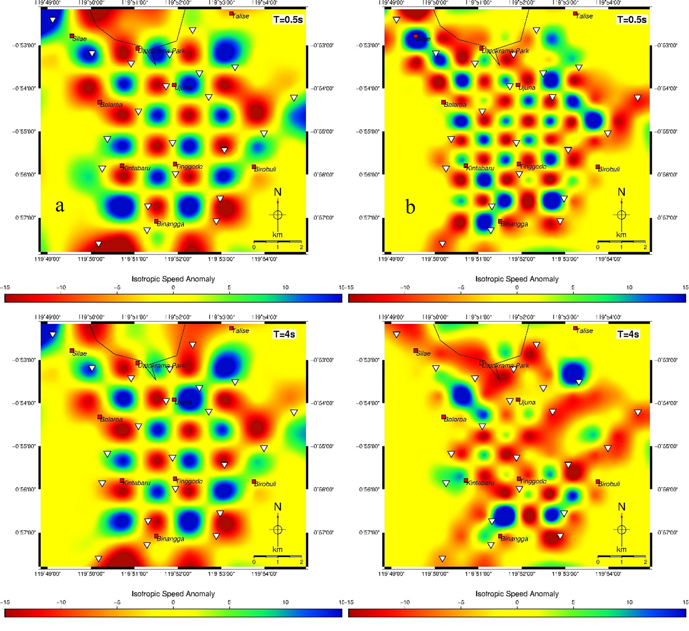

# Shear-Wave Velocity Structure of Palu from Ambient Seismic Noise Tomography (ANT)

My bachelor thesis project at Institut Teknologi Bandung (Geophysical Engineering), published as:

Ikhsan, F. A. W. and Yudistira, T. (2019). *Shear Wave Velocity Structure Construction Using Ambient Seismic Noise Tomography (ANT) in Palu, Central Sulawesi.* Jurnal Geofisika, Vol. 17, No. 02, pp. 1–4. HAGI.

I am the first author. I processed the data, ran the tomography and the depth inversion, and interpreted the results; my supervisor is the second author.

> **Note on documentation:** The paper in the `documentation/` folder has an English title and abstract; the main text is in Bahasa Indonesia. Everything is summarised below in English.

---

## Project overview

| | |
|---|---|
| **Question** | What does the shear-wave velocity structure under Palu look like, and where are the thick, soft sediments? |
| **Method** | Ambient seismic noise tomography: cross-correlation of continuous noise, group-velocity tomography, depth inversion with particle swarm optimization (PSO) |
| **Data** | Seismometer recordings from 22 stations, February–May 2015. I used only the vertical component, to get Rayleigh waves. Raw data are not in this repository. |
| **Tools** | Processing programs by Yao et al. (2006), Yudistira et al. (2017) and Farduwin (personal communication, May 2019). I applied them to the Palu data, chose and checked the parameters, and interpreted the results. |
| **Output** | Group-velocity maps (periods 0.5–5 s) and S-wave velocity maps at 0.5–5 km depth |

## Why Palu

Palu lies on the Palu-Koro Fault, a left-lateral fault system, and was hit by the Palu-Donggala earthquake of 28 September 2018 (7.5 Mw). Thick sediments amplify ground motion, so knowing where they are matters for hazard studies. An earlier microtremor study (Thein et al., 2014) found sediment thicknesses of 25–125 m, thickest in the north. I wanted to see the structure deeper than that, down to several kilometres, using only passive data.

## How ANT works, in plain words

Two seismic stations record the constant, weak vibration of the ground ("ambient noise"). If I cross-correlate the two recordings over a long time, the result approximates the signal one station would record if the other were a source. From these signals I can measure how fast surface waves travel between station pairs and turn that into velocity maps, with no earthquake and no active source.

---

## What I did

| # | Step | Details |
|---|---|---|
| 1 | **Single-station preparation** | Demeaning, detrending, spectral whitening, filtering in the period band 0.5–6 s, and one-bit normalisation. Records stacked per station and per day, depending on data availability. |
| 2 | **Cross-correlation** | Cross-correlated station pairs and stacked the results: **212 cross-correlation functions (CCFs)**. In the gather, V-shaped gradients show the dispersive behaviour. |
| 3 | **Dispersion curves (FTAN)** | Frequency-time analysis for periods 0.5–5 s (step 0.01 s, time-domain filter centred at 2.5 s, bandwidth 0.1 s). I only picked curves where the signal-to-noise ratio was above 5 and the station distance was at least one wavelength. Group velocities range from 0.2 to 2 km/s. |
| 4 | **Group-velocity tomography** | Linear inversion for periods of 0.5, 1, 1.5, ... 5 s on an 8 × 8 grid. A trade-off analysis gave smoothing and damping of 6. The reference model is the mean velocity of the dispersion curves at each period, and outliers were removed (threshold 10). Checkerboard tests (8 × 8 and 12 × 12 grids) showed **24 well-resolved cells**. |
| 5 | **Depth inversion (PSO)** | Particle swarm optimization at the 24 well-resolved cells with 11 parameters per cell (6 layer velocities, 5 layer thicknesses). Velocity range 0.2–2 km/s; thickness range 0.5–0.75 km for the first layer and 0.5–1.75 km for the others. Result: S-wave velocity maps at 0.5–5 km depth. |

## Visual gallery

### Stations and cross-correlation

| 22-station layout | Cross-correlation gather |
|---|---|
|  |  |

### Resolution test and final maps

| Checkerboard resolution test | S-wave velocity maps (0.5–5 km depth) |
|---|---|
|  |  |

---

## What I found

- **Group velocity:** a low anomaly of about −5% in the north, a high anomaly of about +15% in the west and centre, and a low anomaly of about −7% in the south-east.
- **S-wave velocity at 0.5–1 km depth:**
  - North: low velocity (−7%), which I interpret as coastal sediment.
  - West: high velocity (+15%), relatively hard rock and a topographic high.
  - South-east: low velocity (−10%), thick sediment.
- **Fault:** a velocity contrast in the south suggests a north-south trending fault. I see it only in the southern part of the city.
- **Geology:** the velocity pattern fits three main units: Quaternary sediments, the Palu Metamorphic Complex and a granitoid.
- **Hazard link:** the thick sediments probably contributed to the damage in 2018. The structure agrees with several earlier studies.

## Limitations

- Only 22 stations and about three months of data. The grid is coarse (8 × 8) and only 24 cells were well resolved, so the maps show the large-scale structure, not fine detail.
- The fault evidence comes from the southern part only.
- My interpretation is qualitative and rests on comparison with earlier studies. I did not validate the velocities independently, for example with boreholes.
- The paper is short (four pages) and does not include sensitivity tests of the parameter choices.
- The processing programs were developed by others; my work is the application of this workflow to the Palu data and the interpretation.

## What I learned

- Processing continuous seismic data: preparation, cross-correlation, stacking and picking, with quality rules (SNR above 5, minimum station distance).
- Regularised linear tomography with trade-off analysis and resolution tests, and PSO for a layered model.
- Reading velocity anomalies together with the geology of an area.
- Taking a paper through submission, revision and acceptance.

## References

- Bensen et al. (2007). Geophys. J. Int., 169, 1239–1260.
- Yao, van der Hilst and de Hoop (2006). Geophys. J. Int., 166(2), 732–744.
- Yudistira, Paulssen and Trampert (2017). Tectonophysics, 721, 361–371.
- Wapenaar et al. (2010). Geophysics, 75, 75A195–75A209.
- Thein et al. (2014). Int. J. of Geological and Environmental Engineering, 8, 308–319.

## Repository contents

```text
.
├── README.md
├── documentation/   # the published paper (PDF)
└── assets/          # figures used in this README
```

## Author

Fashli Adli Wal Ikhsan · [github.com/fashliadli](https://github.com/fashliadli)
